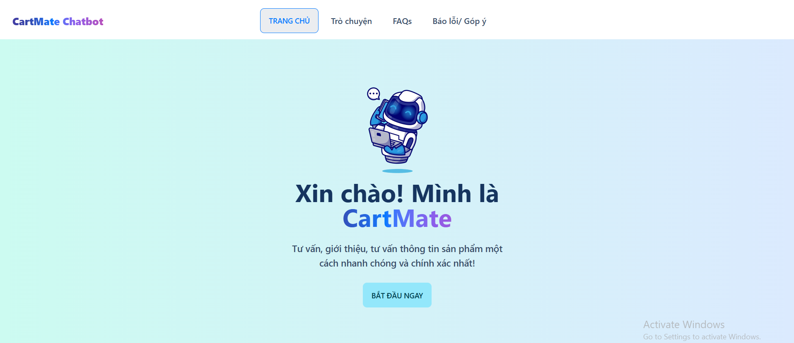

# RAG Store Assistant
## Homepage

## Introduction
RAG Store Assistant is an intelligent chatbot system designed to assist users in searching for products, answering FAQs, and providing personalized recommendations. Built on the **RAG (Retrieval-Augmented Generation)** model, the system combines **Hybrid Search** (Semantic Search + Keyword Search) for efficient information retrieval and **Gemini-1.5-flash** for natural language generation. The backend is powered by **FastAPI**, while the frontend is built using **Node.js**. The system is containerized using **Docker** for easy deployment and scalability.

This project is the final assignment for the course **CS311.P11**, developed by the following team members:
- **Đinh Thiên Ân** - 22520010
- **Huỳnh Trọng Nghĩa** - 22520003
- **Lê Trần Gia Bảo** - 22520105

## Features
- **Product Search**: Find products based on user queries (e.g., name, color, size).
- **FAQ Support**: Automatically answer common questions about policies, shipping, and returns.
- **Order Tracking**: Provide real-time updates on order status.
- **Hybrid Search**: Combines Semantic Search and Keyword Search for accurate and flexible retrieval.
- **Natural Language Generation**: Uses Gemini-1.5-flash to generate human-like responses.

## Installation

### Prerequisites
- Python 3.8+
- Node.js 16+
- Docker (optional)

### Steps
1. Clone the repository:
   ```bash
   git clone https://github.com/your-username/rag-store-assistant.git
   cd rag-store-assistant
2. Install backend dependencies:
    
    ```bash
    pip install -r requirements.txt

3. Install frontend dependencies:
    
    ```bash 
    cd frontend
    npm install
4. Set up environment variables:
    
    ```bash
    MONGODB_URI=your_mongodb_connection_string
    GEMINI_API_KEY=your_gemini_api_key
    
## Usage 
### Backend

To start the backend server, run:
    
    uvicorn app:app --reload

### Frontend
To build and run the frontend, navigate to the frontend directory and run:
    
    npm run build
    npm run dev
    
The frontend will be available at http://localhost:5127.

## Project Structure
    ``` bash
    rag-store-assistant/
    ├── backend/               # Backend code (FastAPI)
    │   ├── app/               # Main application logic
    │   ├── models/            # Data models
    │   ├── utils/             # Utility functions
    │   └── requirements.txt   # Python dependencies
    ├── frontend/              # Frontend code (Node.js)
    │   ├── public/            # Static assets
    │   ├── src/               # React components
    │   └── package.json       # Node.js dependencies
    ├── docker-compose.yml     # Docker configuration
    └── README.md              # Project documentation

### License
This project is licensed under the MIT License. See the LICENSE file for details.

    


